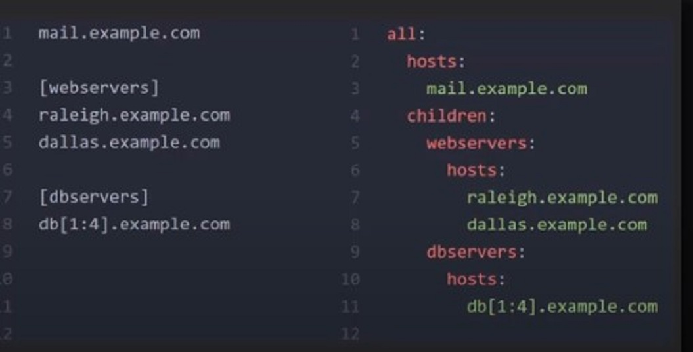
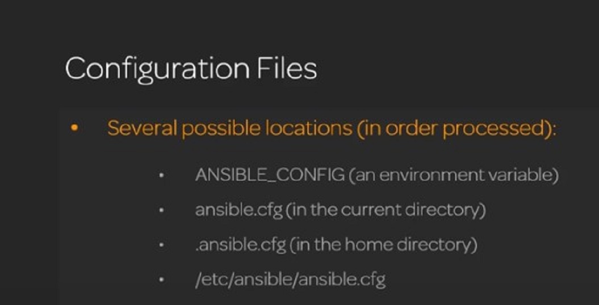
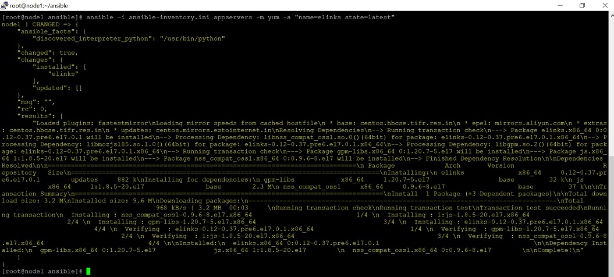
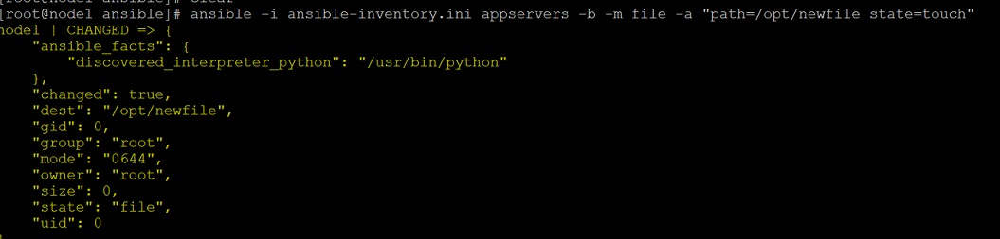
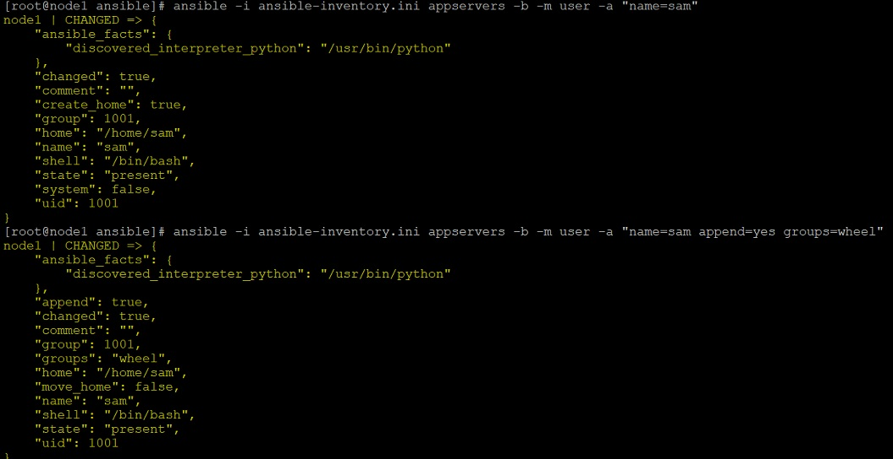

## Introduction To Ansible 

Ansible is one of the important orchestration tool that forms an integral part of Devops lifecycle.As its a vast subject , we are going to cover it in four parts. Lets begin with the first part.

Ansible is an open-source software provisioning, configuration management, and application-deployment tool. It runs on many Unix-like systems, and can configure both Unix-like systems as well as Microsoft Windows. It includes its own declarative language to describe system configuration.

Ansible was written by Michael DeHaan and acquired by Red Hat in 2015. Ansible is agentless, temporarily connecting remotely via SSH or remote PowerShellto do its tasks.

*	Ansible code is written in YAML.
*	YAML is a markup language used for formatting data.
*	It consists of simple key value pairs, lists and dictionaries
*	Files open with 3 hyphens in the first line and close with three periods in the end
*	List items are designated by a single hyphen and a space
*	Each list item should have the same indentation
*	Dictionaries are designated with a colon and a space followed by indented key-value pairs.

## Ansible Installation

In our lab setup we have 3 centos 7  machines running on Oracle VirtualBox
192.168.1.11            node1.example.com       node1 
192.168.1.12            node2.example.com       node2 
192.168.1.13            node3.example.com       node3

Now we are going to install ansible on node1. Execute below command to do the same

```
yum install wget -y
wget http://dl.fedoraproject.org/pub/epel/epel-release-latest-7.noarch.rpm ## Install the epel reppository
rpm -ivh epel-release-latest-7.noarch.rpm
yum install ansible -y
```
That’s it, its as simple as that. We are good to go now.

## Core Components Of Ansible 

__Inventories__
*	Inventories are how ansible can locate and run against multiple systems.
*	We can think of an inventory as a list of hosts.
*	By default, ansible uses /etc/ansible/hosts as its inventory, the path is configurable though and we will see later how it can be modified.
*	Inventories can be formatted as INI format or yaml format.




*	We will not go with the default hosts file of ansible and rather we will create our own.
*	We will create a directory “ansible” on the path /root/ and inside this directory we will create our own ansible hosts file as shown below.

```
[root@node1 ansible]# pwd
/root/ansible
[root@node1 ansible]# ll
total 4
-rw-r--r-- 1 root root 61 Aug 10 18:34 ansible-inventory.ini
[root@node1 ansible]# cat ansible-inventory.ini
[appservers]
node1
[webservers]
node2
[dbservers]
node3
```

Here this file consists of different servers on which the commands will be executed. We can group servers together and execute commands on them groupwise,Here we have 3 groups appservers,webservers and dbservers having 1 server each. All servers should have passwordless ssh between them.
Let’s start with executing a really simple command, lets ping the server in “appservers” group.

```
[root@node1 ansible]# ansible -I ansible-inventory.ini appservers -m ping
node1 | SUCCESS => {
    “ansible_facts”: {
        “discovered_interpreter_python”: “/usr/bin/python”
    },
    “changed”: false,
    “ping”: “pong”
}
```
__Modules__

-	Modules are essentially tools for particular task
-	Modules can take parameters.
-	They return JSON which can be further read and utilized if needed.
-	We have large number of modules available to do number of tasks. Also, custom modules can be designed.

__Variables__

-	Variables prevent hard coding the values.
-	Variable name should always start with a letter’
-	Can be scoped to a group, host or a playbook.
-	Variables can also be directories.

__Facts__
-	Facts provide certain information about the given target hosts.
-	Facts are discovered automatically by Ansible when it reaches out to the host.
-	Facts gathering may be disabled as it can be a performance hit sometimes when we are working on large number of hosts.
-	Below used setup module will display all the facts about system.

```
ansible -i ansible-inventory.ini appservers -m setup
```

__Plays And Playbooks__

-	The goal of a play is to map a group of hosts to some well defined roles
-	A play may use one or more modules to achieve the desired end state of a group of hosts.
-	A playbook is a series of plays.
-	Playbooks are useful when we are working on a larger set of hosts and we need to do multiple things on different group of hosts e,g. Install and run httpd on web servers , install mysql on DB servers etc.

__Configuration Files__

-	Ansible is a software and so has configuration files. Configuration files can be at a number of places. Below is the list of locations where config file is looked for 



## Run Adhoc Ansible Commands 

*	Adhoc commands in Ansible are one liner that will do simple tasks for us.
*	Playbooks on the other hand are series of commands that we give in a .yml file.
*	Adhoc commands are useful when we need to perform quick tasks e.g.  collecting log files and having a look at them, or to check if a particular service is running or not, or to check if a software is installed or not, or may be the disk usage on a particular server and so on.

	A simple example of Adhoc command is as below 
```
ansible -i ansible-inventory.ini appservers -m yum -a "name=httpd state=latest" -f 100
```
Lets discuss the flags as below

*	-i : This is used to override the default inventory file and give a different hosts file.
*	-b : can be used to run a command with a different user, by default it will run the command with the user with which ansible is running.
*	-m : To specify the module
*	-a : To pass arguments. Note that this can be used without -m to execute a shell command on the servers. e.g.: -a “touch /tmp/newfile”
*	-f : This is used to specify the value for parallelism, 100 here means that ansible will run 	
this command on 100 hosts at once. ( This is irrelevant for us as we are working with only 3 hosts.


## Adhoc Command Examples

*	__yum module__ 

Used to install packages (rpms). In the below example elinks rpm will be installed.

```
ansible -i ansible-inventory.ini appservers -m yum -a "name=elinks state=latest"
```


Now let us try to uninstall the elinks rpm.We need to just set the state to “absent”

```	      
ansible -i ansible-inventory.ini appservers -m yum -a "name=elinks state=absent"
```
*	__file module__ 

This module is useful for managing/creating files. Lets create a new file in /opt using file module.
 
```
ansible -i ansible-inventory.ini appservers -b -m file -a "path=/opt/newfile state=touch"
```


Below are some more examples of ways to using file module 

__To Know The Properties Of A File__


```
[root@node1 ansible]# ansible -i ansible-inventory.ini appservers -b -m file -a "path=/opt/newfile"
node1 | SUCCESS => {
    "ansible_facts": {
        "discovered_interpreter_python": "/usr/bin/python"
    },
    "changed": false,
    "gid": 0,
    "group": "root",
    "mode": "0644",
    "owner": "root",
    "path": "/opt/newfile",
    "size": 0,
    "state": "file",
    "uid": 0
}
```

__To Change The File Permissions__

``` 
[root@node1 ansible]# ansible -i ansible-inventory.ini appservers -b -m file -a "path=/opt/newfile mode=0400"
node1 | CHANGED => {
    "ansible_facts": {
        "discovered_interpreter_python": "/usr/bin/python"
    },
    "changed": true,
    "gid": 0,
    "group": "root",
    "mode": "0400",
    "owner": "root",
    "path": "/opt/newfile",
    "size": 0,
    "state": "file",
    "uid": 0
}

```

__To change the user owner of the file__

```
[root@node1 ansible]# ansible -i ansible-inventory.ini appservers -b -m file -a "path=/opt/newfile owner=piyush"
node1 | CHANGED => {
    "ansible_facts": {
        "discovered_interpreter_python": "/usr/bin/python"
    },
    "changed": true,
    "gid": 0,
    "group": "root",
    "mode": "0400",
    "owner": "piyush",
    "path": "/opt/newfile",
    "size": 0,
    "state": "file",
    "uid": 1000
}

```

__To Change The Group Owner Of The File__


```
[root@node1 ansible]# ansible -i ansible-inventory.ini appservers -b -m file -a "path=/opt/newfile group=piyush"
node1 | CHANGED => {
    "ansible_facts": {
        "discovered_interpreter_python": "/usr/bin/python"
    },
    "changed": true,
    "gid": 1000,
    "group": "piyush",
    "mode": "0400",
    "owner": "piyush",
    "path": "/opt/newfile",
    "size": 0,
    "state": "file",
    "uid": 1000
}

```

*	__user module__ 

We will now use user module to create and to change properties of user. Here we will add additional user “sam” to the appservers  group of hosts and assign additional groups to him.



```
ansible -i ansible-inventory.ini appservers -b -m user -a "name=sam" 
ansible -i ansible-inventory.ini appservers -b -m user -a "name=sam append=yes groups=wheel" # user sam added to additional group called wheel
```

We hope that you are able to set up your basics right from here.Lets move to second part and learn about some more ansible stuff.


