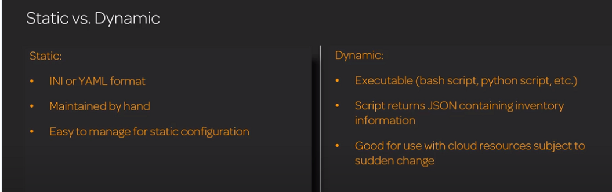
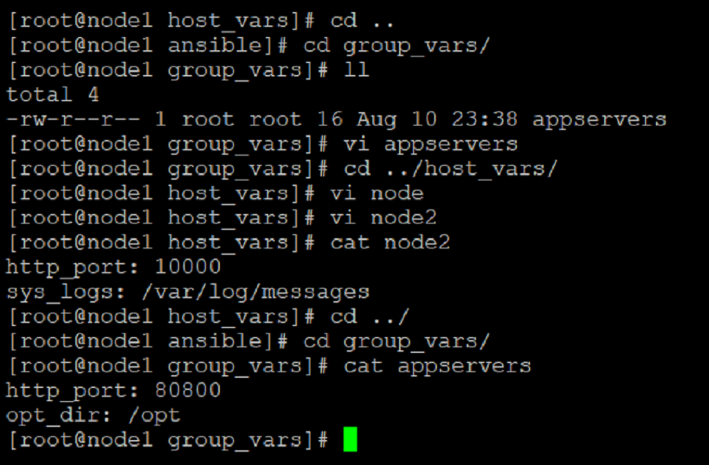
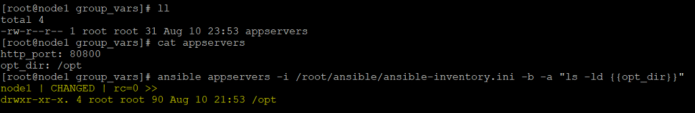
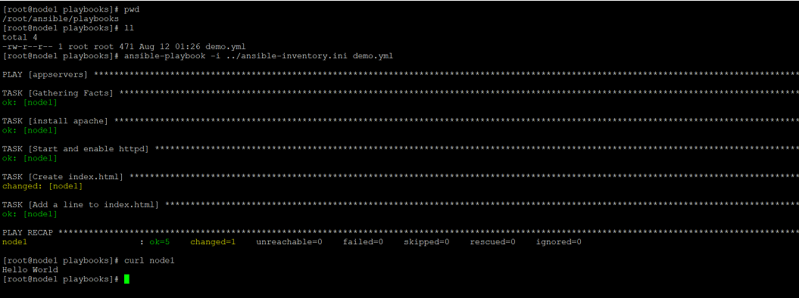

## Ansible Inventory Management

*	An inventory is a list of hosts that Ansible manages
*	Inventory location may be specified as follows
a)	Default:/etc/ansible/hosts
b)	Specified by CLI using -i flag
c)	Can be set in ansible.cfg
*	An inventory files may contain hosts, patterns, groups or variables
*	An inventory may be static or dynamic.
*	Static inventory is a yaml or INI file
*	Dynamic inventory is a an executable (bash script or python script). This script is given by the server vendor eg aws, azure etc depending upon our environment.



### Variables and Inventory 

Ansible recommends not to keep variables in the inventory file but to keep them in the area of inventory file i.e. in the same directory where inventory file is kept. Separate directories for host and group related variables would be

*	group_vars
*	host_vars




Here we passed the variable in the ansible command and got the desired output.


## Create Ansible Plays and Playbooks

*	Playbooks are yaml files, set of instructions that can do tasks for us.
*	Below is an example of a yaml playbook that will install and configure httpd on the group of servers called appservers 


```
[root@node1 playbooks]# cat apache_install.yml
---
- hosts: appservers
  become: yes
  tasks:
    - name: install apache
      yum:
        name: httpd
        state: latest
    - name: Start and enable httpd
      service:
        name: httpd
        state: started
        enabled: yes
    - name: Create index.html
      file:
        path: /var/www/html/index.html
        state: touch
    - name: Add a line to index.html
      lineinfile:
        path: /var/www/html/index.html
        line: "Hello World"
```

To execute a playbook we will use the below command

```

[root@node1 playbooks]# pwd
/root/ansible/playbooks
[root@node1 playbooks]# ll
total 4
-rw-r--r-- 1 root root 471 Aug 12 01:26 apache_install.yml
[root@node1 playbooks]# ansible-playbook -i ../ansible-inventory.ini demo.yml
ansible-playbook -i ../ansible-inventory.ini apache_install.yml–limit node1
```

Here we have used –limit flag to limit the execution only to a single host ( This may be useful when we want to check if the playbook is working fine.)



## Use Of Variables (Get Results Of Command Being Executed)

*	We can do so with the use of ‘’register keyword”
*	Here we will see how to get all the output and specific output as well

Below is the example playbook

```
[root@node1 playbooks]# cat register_demo.yml
---

- hosts: all
  tasks:
    - name: Create file
      file:
        path: /tmp/newfile
        state: touch
      register: output
    - debug: msg= "debug info is {{ output }}"
    - name: Edit the file
      lineinfile:
        path: /tmp/newfile
        line: "{{ output.uid}}"’
```

## 	Use Condition To Control Play Execution

*	There are possible ways in ansible to execute different parts of playbook depending upon the conditions. We can do this with the help of ‘’ handlers,notify and listen’’keywords.

*	Below is the example for such a scenario. Here apache service will be restarted only if a change in file is made. If no change is there then the service will not be started.


``` 
---
- hosts: all
  become: yes
  handlers:
    - name: restart apache
      service: name="httpd" state="restarted"
      listen: "restart web"
  tasks:
    - name: Create new document root directory
      file:
        path: /opt/www
        state: directory

    - name: change config
      replace:
        path: /etc/httpd/conf/httpd.conf
        regexp: '^DocumentRoot.*$'
        replace: 'DocumentRoot "/opt/www"'
        backup: yes
      notify: "restart web"

```

## Loops And Conditions In Ansible Playbooks 

*	Loops can be implemented with “with_items” keyword.
*	Below is an example of a playbook to create 3 new users on the hosts.

```
[root@node1 playbooks]# cat create_users_with_items_demo.yml
---
- hosts: all
  become: yes
  tasks:
    - name: Create users
      user:
        name: "{{item}}"
      with_items:
        - sam
        - john
        - sarah
```

*	Run the playbook 

```
ansible-playbook -i ../ansible-inventory.ini create_users_with_items_demo.yml
```
*	On verifying we will find that the usesr have been created.

```

[root@node1 playbooks]# id sarah
uid=1003(sarah) gid=1003(sarah) groups=1003(sarah)
[root@node1 playbooks]# id john
uid=1002(john) gid=1002(john) groups=1002(john)
[root@node1 playbooks]# id sam
uid=1001(sam) gid=1001(sam) groups=1001(sam),10(wheel)
```

## Conditional Execution With "when" Keyword

Here we will modify index.html file of a specific host depending upon its name and we will use the “when” keyword.

```
[root@node1 playbooks]# cat when_keyword_demo.yml
---

- hosts: all
  become: yes
  tasks:
    - name: edit index
      lineinfile:
        path: /var/www/html/index.html
        line: "I am modifying the web content"
      when:
        - ansible_hostname == "node1"


[root@node1 playbooks]# curl node1
Hello World
I am modifying the web content

```

## Error Handling In Ansible 

*	Error handling in Ansible is important because ansible playbook stops the execution as soon as it comes across an error message. But there can be scenarios where the message is just a general warning and we want to ignore it so that the playbook will move forward. For this we need error handling.
*	To demonstrate the same we will stop httpd on node2 and node3 and node1 will be the only node that will have httpd running. 

```
[root@node1 playbooks]# cat ignore_errors_demo.yml
---

- hosts: all
  become: yes
  tasks :
  - name: Get files
    get_url:
      url: "http://{{item}}/index.html"
      dest: "/tmp/{{item}}"
    ignore_errors: yes
    with_items:
      - node1
      - node2
      - node3
```

Httpd is running only on node1 so it will have a successful result, other two hosts which has httpd stopped will throw error but ansible will ignore it and move ahead.


## Error Handling(Block Groups)

*	This is the other way to handle error, what is to be checked is written in a block. If the block is erroneous, then the rescue block is activated and we are displayed a debug message. If the block is passed, then the rescue block is not invoked.
*	Note that “always” section gets executes whether the playbook pass or fails.Below is an example of Block groups .
*	Httpd is running only on node1 and is stopped on other hosts.

```
[root@node1 playbooks]# cat error_handling_block_groups.yml

---
- hosts: all
  tasks:
    - name: Get File
      block:
        - get_url:
            url: "http://node1/index.html"
            dest: "/tmp/index_file"
      rescue:
        - debug: msg="The file does not exist"
      always:
        - debug: msg="Play done!"
```

	__/tmp/index_html should not exists already__


## Selective Execution Based On Tags

*	Tags are helpful in including or excluding certain part of code from executing or not executing.
*	Let’s see an example for this 

```
---
- hosts: all
  tasks:
    - name: Install Apache and ntp
      yum:
        name: "{{ item }}"
        state: present
      with_items:
        - httpd
        - ntp
      tags:
        - http


    - name: Work on Configuration Tag
      yum:
        name: "{{ item }}"
        state: present
      with_items:
        - telnet
        - postfix
      tags:
         - telnet
```

*	Try executing scripts with different tags 

```
ansible-playbook -i ../ansible-inventory.ini tag_based_execution.yml  --tags http
```


Hope you are enjoying the series of tutorials, Lets move on to the third part and read more about ansible. 


