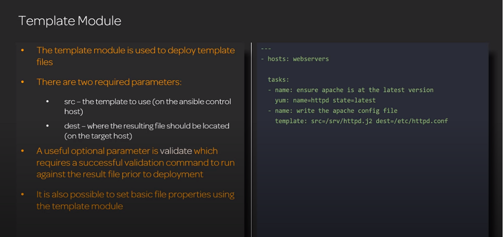
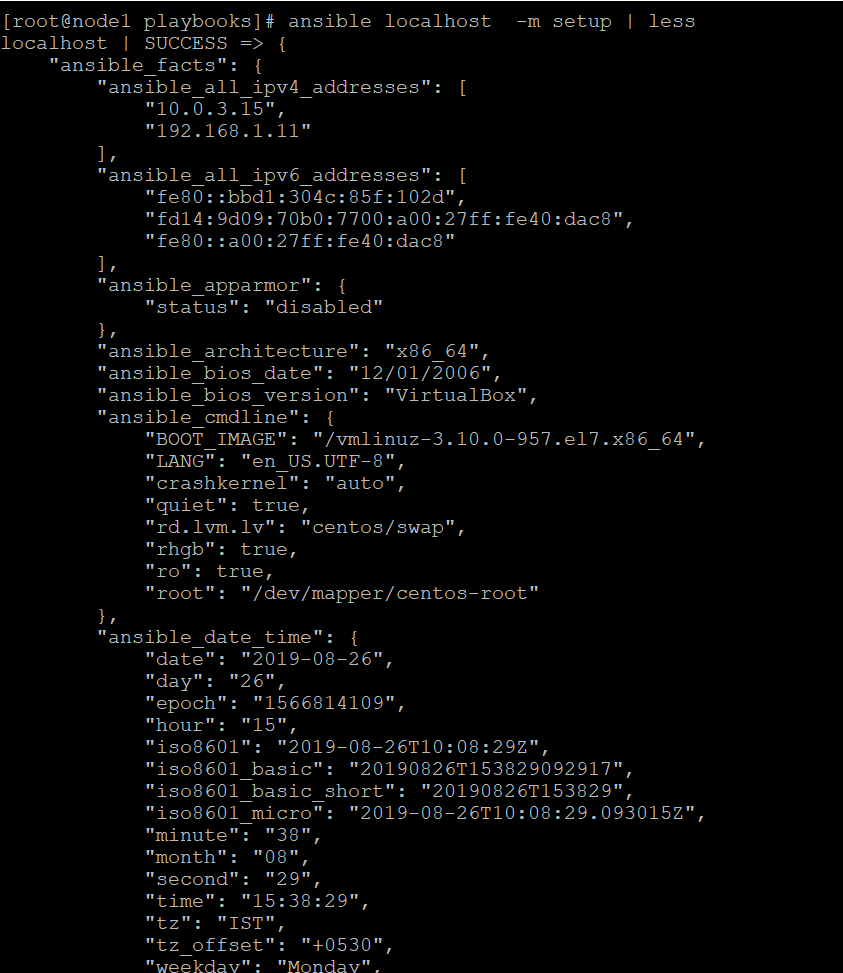
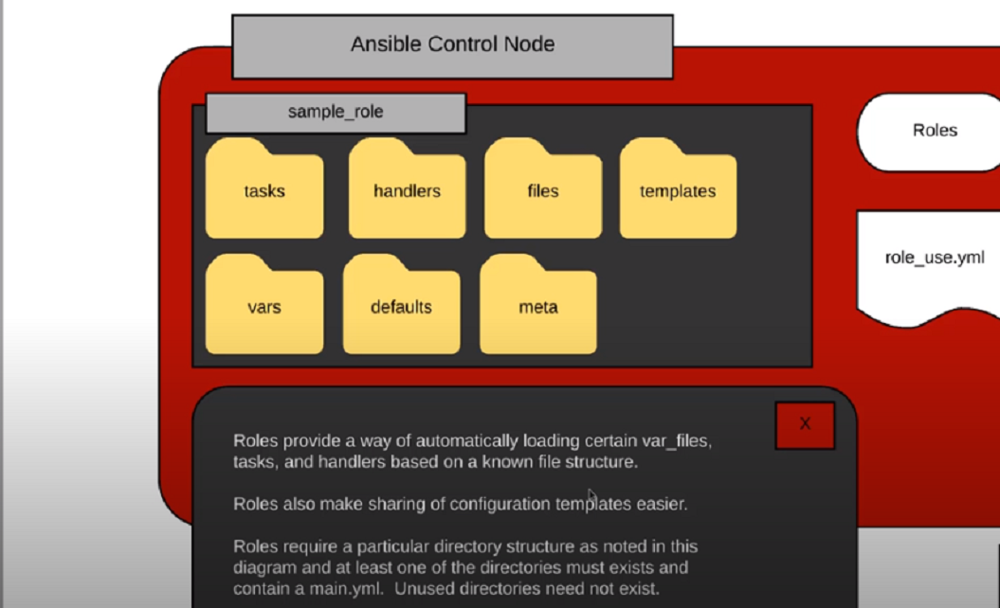
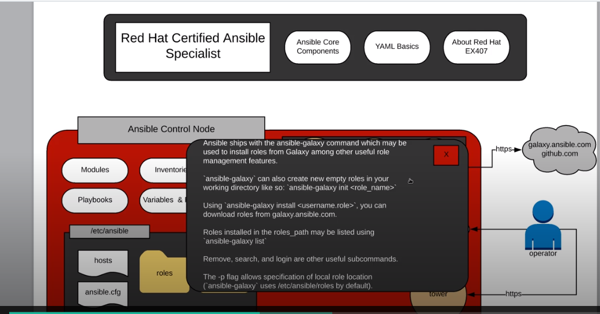
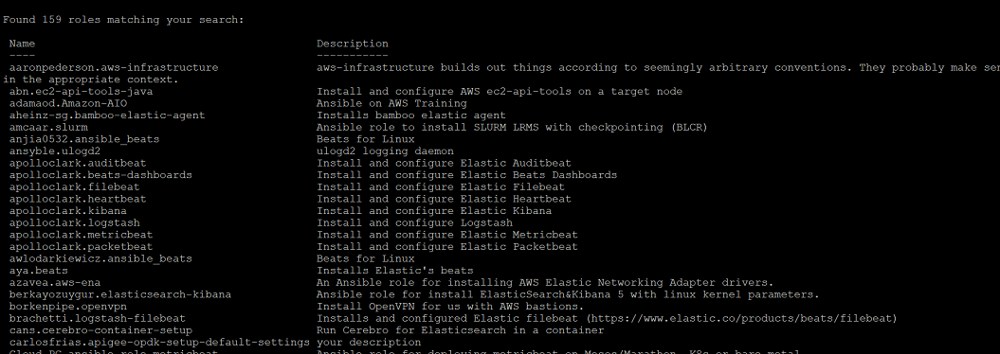

Let us move forward and read about templating in Ansible.

## Create And Use Templates To Create Customised Configuration Files(Jinja Templates)

*	Templates give the ability to provide a skeletal file that can be dynamically completed using variables.
*	The most common template use case is configuration file management.
*	Templates are generally used by providing a template file on the ansible control node and then using the template module within your playbook to deploy the file on a target server or group.
*	Templates are processed using jinja2 template language.
*	Templates have an extension of .j2



### Demo

Login to the controller node and go to the directory where we have created the playbooks

/root/ansible/playbooks

```
[root@node1 playbooks]# cat sample.j2
{{ variable1 }}
No effects on this line
{{ variable2 }}

[root@node1 playbooks]# cat templatedemoplaybook.yml
---
- hosts: all
  vars:
    variable1: 'Hello...!!!'
    variable2: 'My first playbook using template'
  tasks:
    - name: Basic Template Example
      template:
        src: sample.j2
        dest: /root/ansible/playbooks/output.txt
```

## Ansible Variables And Facts 

Variable names should be letters, numbers, and underscores. Variables should always start with a letter.
We have already used ansible variables in the earlier part of the lecture, lets discuss other type of variables called dictionary variables.Ansible have some already pre-defined variables which are called __magic variables__ .

An example of dictionary variable is below 

employee:
	name:bob
	id:42

To reference the value there are two types of notations that can be used 
	employee[‘name’]
	employee.name

```
[root@node1 playbooks]# cat var_demo.yml
---
- hosts: all
  vars:
    inv_file: /home/piyush/inv.txt
  tasks:
  - name: Create  a file
    file:
      path: "{{ inv_file }}"
      state: touch
  - name: generate inventory
    lineinfile:
      path: "{{ inv_file }}"
      line: "{{ groups['allservers']|join(': ')}}"

[root@node1 playbooks]# cd /home/piyush/
[root@node1 piyush]# pwd
/home/piyush
[root@node1 piyush]# cat inv.txt
node1: node2: node3

```

### Variable Files

* 	We can create a variable file and pass it in the command line wih -e flag


```
ansible-playbook -i ../ansible-inventory.ini users.list.yml -e "@users.list"


[root@node1 playbooks]# cat  users.list
developers:
 - john
 - sarah
 - tom
 - bob
admins:
 - Kevin
 - Mary
testers:
 - Jeff
 - Lee
[root@node1 playbooks]# cat  users.list.yml
---
- hosts: appservers
  vars:
    userfile: /root/ansible/playbooks/newusers.list
  tasks:
    - name: Create file
      file:
        state: touch
        path: "{{ userfile}}"
    - name: List Users
      lineinfile:
         path: "{{ userfile}}"
         line:  "{{ item}}"
      with_items:
        -  "{{ developers}}"
        -  "{{ admins}}"
        -  "{{ testers}}"

[root@node1 playbooks]#  ansible-playbook -i ../ansible-inventory.ini users.list.yml -e "@users.list"

PLAY [appservers] *******************************************************************************************************************************************

TASK [Gathering Facts] **************************************************************************************************************************************
ok: [node1]

TASK [Create file] ******************************************************************************************************************************************
changed: [node1]

TASK [List Users] *******************************************************************************************************************************************
changed: [node1] => (item=john)
changed: [node1] => (item=sarah)
changed: [node1] => (item=tom)
changed: [node1] => (item=bob)
changed: [node1] => (item=Kevin)
changed: [node1] => (item=Mary)
changed: [node1] => (item=Jeff)
changed: [node1] => (item=Lee)

PLAY RECAP **************************************************************************************************************************************************
node1                      : ok=3    changed=2    unreachable=0    failed=0    skipped=0    rescued=0    ignored=0

[root@node1 playbooks]# cat newusers.list
john
sarah
tom
bob
Kevin
Mary
Jeff
Lee

```

## Ansible Facts 





* 	We can add filters while collecting facts as shown below 

```
[root@node1 playbooks]# ansible localhost  -m setup -a "filter=*dist*"
localhost | SUCCESS => {
    "ansible_facts": {
        "ansible_distribution": "CentOS",
        "ansible_distribution_file_parsed": true,
        "ansible_distribution_file_path": "/etc/redhat-release",
        "ansible_distribution_file_variety": "RedHat",
        "ansible_distribution_major_version": "7",
        "ansible_distribution_release": "Core",
        "ansible_distribution_version": "7.6"
    },
    "changed": false
}

```

*	To suit our requirements, we can create custom facts as well. Below is an example for the same.

Custom facts are also called __Local__ facts 

We can create our own custom facts as well. For this login to the node for which you want to create custom facts and create a file on the below path. We will login to node3

```
mkdir -p /etc/ansible/facts.d/
vi data.fact
[location]
type=physical
datacenter: Bengaluru

Now login to the controller node i.e. node1

[root@node1 ansible]# ansible -i ansible-inventory.ini  dbservers -m setup -a "filter=ansible_local"
node3 | SUCCESS => {
    "ansible_facts": {
        "ansible_local": {
            "data": {
                "location": {
                    "datacenter": "Bengaluru",
                    "type": "physical"
                }
            }
        },
        "discovered_interpreter_python": "/usr/bin/python"
    },
    "changed": false
}

```

## Ansible Roles



Roles are ways of automatically loading certain vars_files, tasks, and handlers based on a known file structure. Grouping content by roles also allows easy sharing of roles with other users.

Roles expect files to be in certain directory names. Roles must include at least one of these directories, however it is perfectly fine to exclude any which are not being used. When in use, each directory must contain a main.yml file, which contains the relevant content:

*	tasks - contains the main list of tasks to be executed by the role.
*	handlers - contains handlers, which may be used by this role or even anywhere outside this role.
*	defaults - default variables for the role (see Using Variables for more information).
*	vars - other variables for the role (see Using Variables for more information).
*	files - contains files which can be deployed via this role.
*	templates - contains templates which can be deployed via this role.
*	meta - defines some meta data for this role. 
*	Default path for roles is /etc/ansible/roles


## Download Roles From Ansible Galaxy

Creating roles on our own can sometimes be cumbersome.Ansible is an opensource project and techies from all around the globe write roles and publish it over ansible galaxy so that others can use it. 

Ansible galaxy is repository of community created ansible roles that can be used by others who want to utilize them.
To know more , please visit : :  https://galaxy.ansible.com/




```
[root@node1 galaxy]# pwd
/root/ansible/galaxy
[root@node1 galaxy]# ansible-galaxy init mysql
- mysql was created successfully
[root@node1 galaxy]# cd mysql/
[root@node1 mysql]# ll
total 4
drwxr-xr-x 2 root root   22 Aug 26 18:32 defaults
drwxr-xr-x 2 root root    6 Aug 26 18:32 files
drwxr-xr-x 2 root root   22 Aug 26 18:32 handlers
drwxr-xr-x 2 root root   22 Aug 26 18:32 meta
-rw-r--r-- 1 root root 1328 Aug 26 18:32 README.md
drwxr-xr-x 2 root root   22 Aug 26 18:32 tasks
drwxr-xr-x 2 root root    6 Aug 26 18:32 templates
drwxr-xr-x 2 root root   39 Aug 26 18:32 tests
drwxr-xr-x 2 root root   22 Aug 26 18:32 vars
[root@node1 mysql]

ansible-galaxy search elastic | more



Now go to the path where playbooks are located( the ones that we have created) and create  a small playbook to call the role that we have installed .

To set the default path where galaxy will install the role , comment out relevant line in /etc/ansible/ansible.cfg

```
[root@node1 playbooks]# ansible-galaxy install elastic.elasticsearch
[root@node1 playbooks]# pwd
/root/ansible/playbooks
[root@node1 playbooks]# cat install_elastic_role.yml
- name: Call Elasticsearch role
  hosts: all
  roles:
    - role: elastic.elasticsearch

```
To remove the role 

ansible-galaxy remove  elastic.elasticsearch


That is it for the current tutorial.We will learn more about Ansible in the next part of this series.


