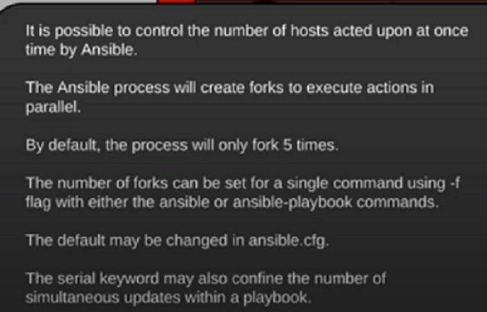

Let us move forward and read about Parallelism in Ansible and Ansible Vault

## Parallelism In Ansible 

*	Ansible supports parallelism that is it works on number of hosts at once in parallel rather than working one at a time.
*	If the ansible control node is a server with good configuration, we can increase the number of parallel processes and this number can be managed by ansible.cfg file.
*	By default, each process can be forked 5 times
*	We can specify a different value with -f flag.



*	Ansible will only fork to the maximum equal to the number of hosts that are present in the inventory, no matter how large fork value we specify.
*	We can mention the fork value in playbooks by the serial key word in the hosts section
serial: 10
max_fail_perceentage: 30  # In the parallel execution if 30% of the execution fails, then whole batch is considered fail.


## Ansible Vault : Dealing With Confidential Data 

This is a ansible way to secure files containing confidential data.In case we have some confidential information in a file , we can encrypt it using ansible vault and then decrypt it.

```
[root@node1 playbooks]# echo "This is a secret file" >> secret.txt
[root@node1 playbooks]# ansible-vault encrypt secret.txt
New Vault password:
Confirm New Vault password:
Encryption successful
[root@node1 playbooks]# cat secret.txt
$ANSIBLE_VAULT;1.1;AES256
35386236356661303433353862333161376436373935323563646634633266616537393335656134
3930653763313963653233393231613834346433383737310a376231663536396131313531386465
32613166626630363161376664633036376432623231393535383537316237383564353962366266
6633393839393761330a323962313461623336326263663165313033333130613063316634346263
63303335653830333861383135353639393537653933333861616563303863353132
[root@node1 playbooks]# ansible-vault edit secret.txt
Vault password:
[root@node1 playbooks]# ansible-vault view  secret.txt
Vault password:
This is a secret file
[root@node1 playbooks]# ansible-vault decrypt   secret.txt
Vault password:
Decryption successful

```

We hope this series of tutorials will help you do your daily opearational tasks at work.
For more information, refer the official Ansible documentation.

< docs.ansible.com >


